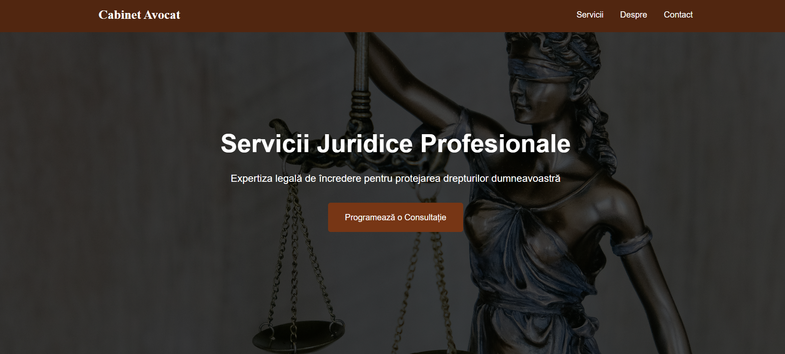
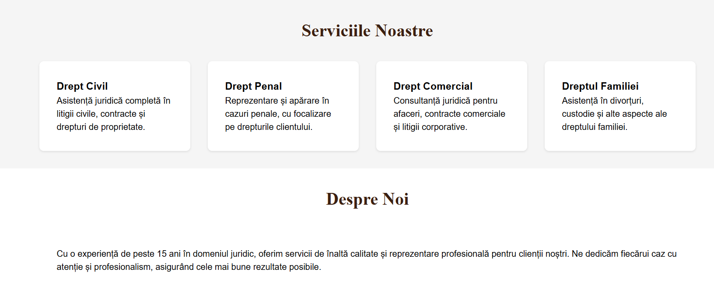
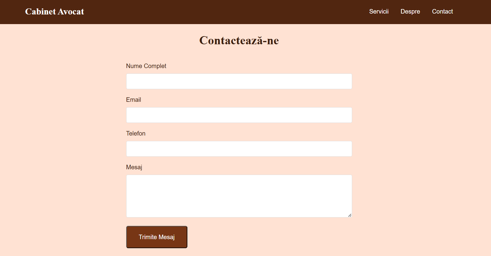
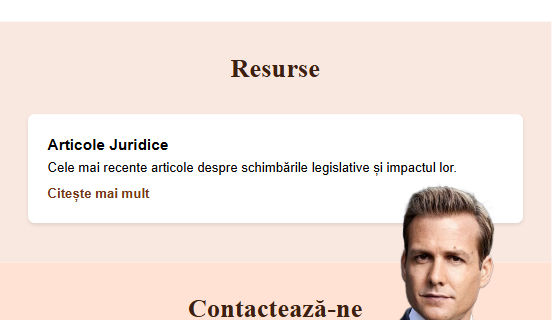
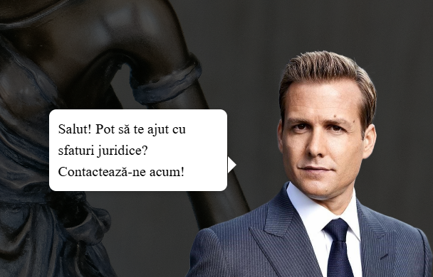

# Cabinet de Avocatură - Landing Page

A professional landing page for a law firm, built with vanilla HTML and CSS.

## Features

- Fully responsive design for mobile and desktop
- Smooth scrolling navigation
- Service showcase
- Contact form
- Modern and professional look
- Mobile-specific resources section
- Interactive mascot with animations
- Hover effects and notifications

## Responsive Features
- Hamburger menu navigation for mobile devices
- Scaling elements for different screen sizes
- Mobile-only resources section
- Optimized form inputs for mobile interaction

## Interactive Elements
- Animated justice scales mascot
- Helpful notification bubbles on hover
- Smooth animations and transitions

## Screenshots

## Live Demo

[View Live Demo](https://nadea-b.github.io/Landing-Page/)

## Development

1. Clone the repository
2. Open `index.html` in your browser
3. Edit the files as needed

## Deployment

The site is deployed using GitHub Pages

## Technologies Used

- HTML5
- CSS3

## Commit History

1. Initial project setup
2. Navigation bar implementation
3. Hero section with call-to-action
4. Services section with grid layout
5. About section
6. Contact form
7. Final documentation and deployment
8. Implement responsive navigation with hamburger menu
9. Make hero section and services responsive
10. Add mobile-only resources section
11. Improve form responsiveness
12. Create justice scales SVG mascot
13. Add mascot container and message bubble
14. Implement mascot animation and delay reveal